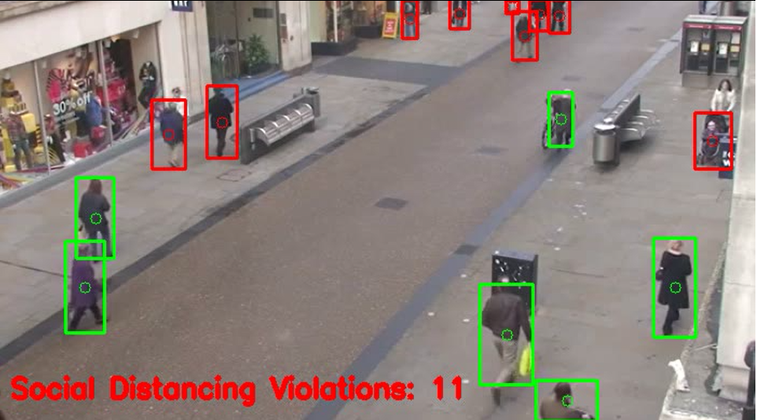

# Social Distancing Using OpenCV and DL

## Objective
   An epidemic COVID-19 which has its rapid spread needs the social distancing betwwen people to avoid
   virus spread and decrease growth of new infections
   The goal is to detect people using object detection and find the distance between people to check
   whether a norm social distance of 1.5m is maintained by people.
   

   
## Tool and Libraries

* Python
* OpenCV
* YoloV3

Requirements File is in the directory

## Description

* Step 1: Find the number of people in the frame/Image.
* Step 2: Creating Bounding Box over the people identified using YOLOV3.
* Step 3: A threshold set for width between two objects in the frame
* Step 4: Based on the threshold verify whether social distancing is practiced or violated 

## Result

